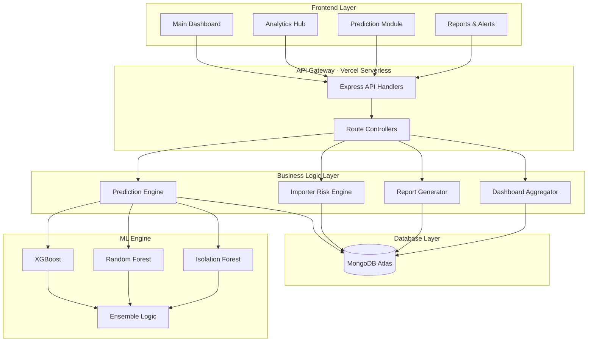

# SmartContainer – Customs Risk Prediction & Intelligent Inspection Prioritization System

> Production-deployed full-stack AI platform for customs container risk screening. Classifies inbound shipments into Critical / Low Risk / Clear tiers using an ensemble ML model, surfaces importer fraud patterns, and enables officers to prioritize physical inspections with objective, explainable risk scores.

Live Demo:
https://smartcontainerrrr.vercel.app/

Backend API:
https://smartcontainer-risk-engine-fwkw.vercel.app/
---
ID : 
admin
Password : 
Admin@12345

In workign demo there quict not working cause of websocket problem in vercel
## Table of Contents

1. [Project Overview](#1-project-overview)
2. [System Architecture](#2-system-architecture)
3. [ML Model Design](#3-ml-model-design)
4. [Feature Engineering](#4-feature-engineering)
5. [Business Rules Engine](#5-business-rules-engine)
6. [API Reference](#6-api-reference)
7. [Frontend Modules](#7-frontend-modules)
8. [Database Schema](#8-database-schema)
9. [Deployment](#9-deployment)
10. [Local Development Setup](#10-local-development-setup)
11. [Environment Variables](#11-environment-variables)
12. [Project Structure](#12-project-structure)
13. [Model Performance](#13-model-performance)
14. [Security](#14-security)

---

## 1. Project Overview

### The Problem

Global customs agencies physically inspect fewer than 5% of arriving containers due to sheer volume. Traditional targeting relies on static rule sets and officer intuition — both are inconsistent, gameable, and poorly adapted to evolving smuggling patterns. Understaffed ports cannot manually review thousands of container declarations arriving each shift.

The result: high-risk shipments with tampered weight declarations, undervalued goods, or importers with a history of critical flags enter the supply chain undetected. Low-risk shipments waste inspection capacity.

### What SmartContainer Does

SmartContainer ingests container declaration data (CSV or XLSX), runs each record through a calibrated ensemble ML model, and produces a structured risk assessment per container. The system:

- Classifies every container as **Critical**, **Low Risk**, or **Clear** based on 31 engineered features derived from shipment metadata
- Assigns a **continuous risk score (0–100)** with a human-readable explanation summary identifying the top contributing risk factors
- Applies **guilt-by-association propagation** — any importer whose historical critical shipment rate exceeds 20% has all new submissions auto-escalated to Critical, regardless of model output
- Runs **Isolation Forest anomaly detection** as an input feature to the supervised classifier, catching statistical outliers that domain rules miss
- Provides officer-facing dashboards showing risk distribution, suspicious importer rankings, HS code fraud patterns, and geographic route risk intelligence
- Generates downloadable CSV and PDF inspection reports scoped to a batch or risk tier
- Exposes a **risk simulator** where officers can manually adjust shipment parameters and see real-time score changes

### Why Risk-Based Screening Matters

Studies across customs administrations consistently show that risk-scored targeting increases interdiction rates 3–5x compared to random selection while reducing officer workload. The WCO SAFE Framework mandates risk-based approaches for all signatory nations. SmartContainer operationalizes this at the shipment level with a model specifically trained on customs declaration features — not a generic fraud detection network.

### Business Impact

| Metric | Baseline (Random) | SmartContainer |
|---|---|---|
| Critical detection rate (recall) | ~5% | 97.1% |
| False positive rate (wasted inspections) | High | Minimized via calibrated thresholds |
| Officer time per prioritization decision | Manual review | Automated, < 1 second per record |
| Importer pattern visibility | None | Full historical escalation analytics |
| Audit trail | Paper-based | Full audit log per action in MongoDB |

---

## 2. System Architecture

### Technology Stack

| Layer | Technology |
|---|---|
| Frontend | React 19, TypeScript, Vite 7, TailwindCSS 4, React Query v5, Recharts, Leaflet |
| Backend | Node.js 18+, Express 4, deployed on Vercel Serverless |
| Database | MongoDB Atlas (Mongoose 7 ODM) |
| Cache | Redis (optional; graceful no-op when unavailable) |
| ML Microservice | Python 3.11+, FastAPI 0.110, XGBoost 2, scikit-learn 1.4, SHAP |
| Job Queue | BullMQ with in-process fallback (no Redis required in dev) |
| Auth | JWT (jsonwebtoken), bcryptjs |
| PDF Reports | PDFKit |
| Validation | Zod (backend schemas), express-validator (routes) |
| Monitoring | prom-client (Prometheus metrics endpoint) |

### Architecture Diagram



### Data Flow

```
User uploads CSV
    |
    v
POST /api/upload/stream  (multipart/form-data)
    |
    v
Multer parses file → /tmp/uploads (Vercel) or ./data/uploads (local)
    |
    v
fileParser.js  →  raw JS objects array
    |
    v
featureEngineering.js  →  31 derived features per record (synchronous, no I/O)
    |
    v
ML microservice  POST /predict-batch  (chunk size: 25)
    |  timeout: 30 s
    |  on failure → heuristic fallback (computeHeuristicRisk)
    v
XGBoost(calibrated) + RandomForest ensemble probabilities
    |
    v
classifyAndExplain()  →  risk_level + explanation_summary
    |
    v
importerHistoryService  →  guilt propagation (>20% historical critical)
    |
    v
Container.bulkWrite() → MongoDB Atlas (upsert on container_id)
    |
    v
Redis cache invalidation  →  dashboard:summary, risk_dist, recent_high_risk
    |
    v
Job record updated (status: completed, metadata.processed_records)
    |
    v
HTTP 200  { success, job_id, batch_id, total, processed, failed }
    |
    v
Frontend React Query refetch triggers dashboard refresh
```

### Serverless Design

The backend runs as a single Vercel Serverless Function via `vercel-entry.js`. Key design decisions for serverless compatibility:

- **Connection caching**: MongoDB and Redis connections are cached in module scope. `connectDB()` checks `mongoose.connection.readyState` before reconnecting, avoiding cold-start latency on warm invocations.
- **No Socket.IO**: Vercel serverless does not support persistent TCP connections. All real-time updates are replaced with React Query polling (`refetchInterval`). The `socketService.js` broadcast functions are architecture-safe no-ops on Vercel.
- **Synchronous upload processing**: `streamUploadController.js` processes all records within the HTTP request lifetime (max 60 seconds per `vercel.json` `maxDuration`). No `setImmediate` background work after response.
- **Writable filesystem**: Only `/tmp` is writable on Vercel. The upload router detects `process.env.VERCEL` and directs multer to `/tmp/uploads`.
- **ML service fallback**: On Vercel, the Python ML microservice is not co-located. If `ML_SERVICE_URL` is not reachable, `predictionService.js` automatically falls back to `computeHeuristicRisk()` — deterministic heuristic scoring based on weight deviation, value anomalies, and country risk tiers.

---

## 3. ML Model Design

### Architecture

The model uses a **binary calibrated ensemble** approach rather than a direct 3-class classifier.

**Why binary instead of 3-class?**  
Ground-truth labels in customs data reliably distinguish "risky" (Detained / Hold / Flagged / Critical) from "clear" (Cleared / Released). The "Low Risk" tier is an inference artefact — there is no clean training label for it. Training a 3-class model on 2 reliable label classes produces a miscalibrated middle bucket. Binary + learned probability thresholds yields more stable, interpretable outputs.

### Models

| Model | Role | Configuration |
|---|---|---|
| XGBoost (CalibratedClassifierCV) | Primary classifier, probability-calibrated via Platt scaling | `n_estimators=300`, `max_depth=6`, weight=0.6 |
| RandomForestClassifier | Secondary ensemble member | `n_estimators=200`, `class_weight='balanced'`, weight=0.4 |
| Isolation Forest | Anomaly feature generator | `contamination=0.1`, output fed as `anomaly_score_feature` to supervised models |

### Threshold Determination

The critical probability threshold is selected automatically using **Youden's J statistic** (J = Sensitivity + Specificity − 1) on the validation set ROC curve. This maximizes the sum of sensitivity and specificity simultaneously without requiring manual tuning.

Learned thresholds from the current model:
- `critical_threshold`: 0.45
- `low_risk_threshold`: 0.40

### Isolation Forest as Input Feature

Isolation Forest is **not a voter** in the ensemble. Its anomaly score is injected as an additional input feature (`anomaly_score_feature`) to the supervised classifiers. This allows XGBoost and RF to learn how much weight to assign to the anomaly signal relative to domain features per-sample. Direct ensemble voting with unsupervised models corrupts calibrated probability outputs.

### SHAP Explanations

Each prediction includes top-3 contributing features via SHAP TreeExplainer (XGBoost-native). When SHAP is unavailable, the system falls back to permutation-importance-derived feature rankings. The explanation surface per container includes:  
`top_feature_1`, `top_feature_2`, `top_feature_3`, `explanation_summary` (human-readable text), `shap_details_json` (raw values for advanced analysis).

### Categorical Encoding

`OrdinalEncoder(handle_unknown='use_encoded_value', unknown_value=-1)` replaces `LabelEncoder`. Unseen categories at inference time map to -1, which the model treats as "other" without raising an exception. This is critical for production stability — new country codes or importer IDs added after training never crash the pipeline.

---

## 4. Feature Engineering

All 31 features are derived synchronously from raw shipment fields in `featureEngineering.js` before any ML call. Engineering happens in a single CPU pass with no I/O.

| Feature | Description |
|---|---|
| `weight_deviation_pct` | `(declared_weight - expected_weight) / expected_weight * 100` |
| `value_per_kg` | `declared_value / declared_weight` — catches under/over-valuation |
| `value_to_weight_ratio` | Alternative ratio for cross-feature interactions |
| `high_risk_country` | Binary flag: origin country in known high-risk tier list |
| `transit_country_count` | Number of intermediate countries in routing |
| `declaration_age_days` | Days since declaration was filed |
| `inspection_history_score` | Aggregate past inspection outcomes for the container |
| `route_risk_score` | Pre-computed per origin-destination pair from historical critical rates |
| `anomaly_score_feature` | Output of Isolation Forest, used as supervised model input |
| `hs_code_risk` | Per-HS-code historical critical rate (label-encoded) |
| `importer_critical_pct` | Importer's historical critical shipment percentage |
| `declared_value_zscore` | Z-score of declared value within HS code cohort |
| `weight_zscore` | Z-score of declared weight within HS code cohort |
| ... | (31 total — see `featureEngineering.js` for full list) |

---

## 5. Business Rules Engine

### Importer Critical History Escalation

Any importer whose **historical critical shipment rate exceeds 20%** (strictly greater-than) has all new shipments automatically escalated to Critical, overriding the ML model output. This is implemented in `importerHistoryService.js`.

Design notes:
- Exactly 20% does **not** trigger escalation
- Importers with zero history do **not** trigger escalation
- Raw model outputs are always preserved in the database for auditability
- Batch processing uses a single MongoDB aggregation per batch — not N per-importer queries

### Hard Override Rules (applied after model score)

These domain rules fire before the probabilistic threshold comparison:

| Condition | Override |
|---|---|
| `abs(weight_deviation_pct) > 50%` | → Critical |
| `declared_value == 0` | → Critical |
| `abs(weight_deviation_pct) < 2% AND anomaly_score < 0.1` | → Clear |

These rules encode non-negotiable customs logic that a statistical model may underweight in edge cases.

---

## 6. API Reference

All endpoints are prefixed with `/api`. Authentication uses `Authorization: Bearer <jwt>` headers.

### Authentication

| Method | Endpoint | Auth | Description |
|---|---|---|---|
| POST | `/api/auth/login` | Public | Login, returns JWT |
| POST | `/api/auth/register` | Admin | Create user account |
| GET | `/api/auth/me` | Required | Current user profile |
| PATCH | `/api/auth/me/profile` | Required | Update profile |
| PATCH | `/api/auth/me/password` | Required | Change password |
| POST | `/api/auth/logout` | Required | Logout (audit log entry) |
| GET | `/api/auth/users` | Admin | List all users |
| PATCH | `/api/auth/users/:id/active` | Admin | Enable/disable user |

### Upload

| Method | Endpoint | Auth | Description |
|---|---|---|---|
| POST | `/api/upload/stream` | Required | Upload CSV/XLSX, synchronous processing, returns full results |
| POST | `/api/upload` | Required | Alternative upload endpoint |
| GET | `/api/upload/batches` | Required | List all upload batches |

**POST /api/upload/stream – Request**

```
Content-Type: multipart/form-data
Field: dataset (file, .csv / .xlsx / .xls, max 50 MB)
```

**POST /api/upload/stream – Response (200)**

```json
{
  "success": true,
  "job_id": "a1b2c3d4-...",
  "batch_id": "e5f6g7h8-...",
  "message": "Processing complete. 980 records classified.",
  "total": 1000,
  "processed": 980,
  "failed": 20
}
```

### Predictions

| Method | Endpoint | Auth | Description |
|---|---|---|---|
| POST | `/api/predict` | Public | Single container risk prediction |
| POST | `/api/predict-batch` | Public | Batch prediction from uploaded CSV |
| POST | `/api/simulate-risk` | Public | Risk simulator — adjust params, get instant score |
| POST | `/api/train` | Admin | Trigger ML model retraining pipeline |
| POST | `/api/reprocess-all` | Admin | Rerun predictions on all stored containers |
| GET | `/api/reprocess-progress` | Admin | Poll reprocessing job progress |

**POST /api/predict – Request**

```json
{
  "container_id": "MSCU1234567",
  "importer_id": "IMP-001",
  "origin_country": "CN",
  "destination_country": "US",
  "declared_value": 15000,
  "declared_weight": 8000,
  "hs_code": "8471.30",
  "shipping_line": "MSC"
}
```

**POST /api/predict – Response**

```json
{
  "success": true,
  "container_id": "MSCU1234567",
  "risk_score": 78.4,
  "risk_level": "Critical",
  "anomaly_flag": true,
  "anomaly_score": 0.82,
  "explanation": "High weight deviation (62%), declared value below HS code cohort average (z=-2.1), high-risk origin country.",
  "top_feature_1": "weight_deviation_pct",
  "top_feature_2": "declared_value_zscore",
  "top_feature_3": "high_risk_country",
  "guilt_propagated": false,
  "processed_at": "2026-03-07T09:00:00.000Z"
}
```

### Dashboard & Analytics

| Method | Endpoint | Auth | Description |
|---|---|---|---|
| GET | `/api/summary` | Public | Aggregate risk counts |
| GET | `/api/dashboard/risk-distribution` | Public | Critical / Low Risk / Clear counts |
| GET | `/api/dashboard/top-risky-routes` | Public | Top origin-destination pairs by critical rate |
| GET | `/api/dashboard/anomaly-stats` | Public | Anomaly detection statistics |
| GET | `/api/dashboard/recent-high-risk` | Public | Recent critical containers |
| GET | `/api/dashboard/containers` | Public | Paginated container list with filters |
| GET | `/api/analytics/route-risk` | Public | Route-level risk intelligence |
| GET | `/api/analytics/suspicious-importers` | Public | Importers ranked by critical rate |
| GET | `/api/analytics/fraud-patterns` | Public | HS code and shipping line fraud signals |
| GET | `/api/analytics/risk-trend` | Public | Risk counts over time |
| GET | `/api/analytics/importer-risk-history` | Public | Full escalation history for an importer |
| GET | `/api/analytics/escalation-stats` | Public | Aggregate escalation statistics |
| DELETE | `/api/containers/all` | Admin | Wipe all container data and jobs |

### Reports

| Method | Endpoint | Auth / Role | Description |
|---|---|---|---|
| GET | `/api/report/summary.csv` | Officer | Full container dataset as CSV |
| GET | `/api/report/summary.pdf` | Officer | Risk analysis summary as PDF |
| GET | `/api/report/predictions.csv` | Officer | Focused CSV: Container_ID, Risk_Score, Risk_Level, Explanation |

All report endpoints accept `?batch_id=`, `?risk_level=`, `?from_date=`, `?to_date=` query parameters.

### Other

| Method | Endpoint | Auth | Description |
|---|---|---|---|
| GET | `/api/jobs` | Required | List background jobs |
| GET | `/api/jobs/:jobId` | Required | Poll job status and progress |
| GET | `/api/tracking/:containerId` | Required | Container shipment tracking |
| GET | `/api/map/containers` | Public | Container locations for map view |
| GET | `/api/map/routes` | Public | Active route GeoJSON |
| GET | `/health` | Public | Service health check |
| GET | `/metrics` | Public | Prometheus metrics |
| GET | `/api/docs` | Public | Swagger UI |

---

## 7. Frontend Modules

The frontend is a single-page application deployed on Vercel with client-side routing. All API state is managed by React Query v5 with 15-second automatic refetch intervals on dashboard data.

| Page | Route | Description |
|---|---|---|
| Dashboard | `/dashboard` | Live risk summary cards, risk distribution donut chart, recent critical containers table, trending alert feed |
| Analytics | `/analytics` | Route risk intelligence map (Leaflet heatmap), suspicious importers table, HS code fraud patterns, risk trend over time (Recharts) |
| Upload | `/upload` | CSV/XLSX drag-and-drop upload, processing progress indicator, batch result summary with per-tier counts |
| Predict | `/predict` | Single container lookup — enter container ID, see full risk breakdown and SHAP explanation |
| Simulator | `/simulator` | Interactive parameter sliders — adjust weight, value, origin, HS code and see risk score update in real time |
| Tracking | `/tracking` | Container-level shipment track with status timeline |
| Map | `/map` | Interactive Leaflet map with container risk markers and route overlays |
| Reports | `/reports` | Download scoped CSV and PDF reports by batch, date range, and risk tier |
| Dossier | `/dossier` | Deep-dive importer profile: full shipment history, escalation timeline, critical rate trend |
| System Access | `/system-access` | Admin: user management, activation/deactivation |
| Profile | `/profile` | Current user profile, session management, notification settings |
| Account Settings | `/account-settings` | Password change, preferences |

---

## 8. Database Schema

All collections are in MongoDB Atlas. Mongoose models are in `backend/src/models/`.

### Container

Primary data store. One document per container declaration.

| Field | Type | Description |
|---|---|---|
| `container_id` | String (unique index) | Customs container reference |
| `importer_id` | String | Importer identifier |
| `origin_country` | String | ISO country code |
| `destination_country` | String | ISO country code |
| `declared_value` | Number | Declared goods value |
| `declared_weight` | Number | Declared weight (kg) |
| `hs_code` | String | Harmonized System code |
| `shipping_line` | String | Carrier name |
| `risk_score` | Number | 0–100 continuous risk score |
| `risk_level` | String | Critical / Low Risk / Clear |
| `anomaly_flag` | Boolean | Isolation Forest outlier flag |
| `anomaly_score` | Number | Isolation Forest raw score |
| `explanation` | String | Human-readable SHAP summary |
| `upload_batch_id` | String | UUID of the upload batch |
| `inspection_status` | String | NEW / INSPECTED / CLEARED / HELD |
| `processed_at` | Date | Prediction timestamp |

### Job

Tracks upload and reprocessing jobs.

| Field | Type | Description |
|---|---|---|
| `job_id` | String (unique) | UUID |
| `type` | String | UPLOAD_DATASET / REPROCESS_ALL |
| `status` | String | active / completed / failed |
| `progress` | Number | 0–100 |
| `metadata` | Object | filename, batch_id, total/processed/failed record counts |
| `logs` | Array | Timestamped log entries |
| `created_by` | ObjectId | User reference |
| `started_at`, `completed_at` | Date | Timing |

### User

| Field | Type | Description |
|---|---|---|
| `username` | String (unique) | Login identifier |
| `password_hash` | String | bcryptjs hash (cost 12) |
| `role` | String | admin / officer / analyst |
| `email` | String | Contact address |
| `is_active` | Boolean | Account enabled flag |
| `settings.notifications` | Object | highRisk / anomaly / weeklySummary booleans |

### AuditLog

Immutable record of all destructive and security-relevant actions.

| Field | Type | Description |
|---|---|---|
| `action` | String | UPLOAD_DATASET / LOGIN / CLEAR_DATA / etc. |
| `entity_type` | String | Container / Job / User |
| `entity_id` | String | Referenced entity |
| `performed_by` | ObjectId | User reference |
| `metadata` | Object | Action-specific context |
| `timestamp` | Date | Immutable creation time |

---

## 9. Deployment

### Frontend – Vercel

The frontend is deployed as a static Vite build on Vercel.

`frontend/vercel.json` configures SPA client-side routing:

```json
{
  "rewrites": [
    { "source": "/((?!assets|favicon|logo|icon|manifest).*)", "destination": "/index.html" }
  ]
}
```

Build command: `tsc -b && vite build`  
Output directory: `dist`

### Backend – Vercel Serverless

The backend is deployed as a single serverless function via `vercel-entry.js`.

`backend/vercel.json` key configuration:

```json
{
  "functions": {
    "vercel-entry.js": { "maxDuration": 60 }
  },
  "builds": [
    { "src": "vercel-entry.js", "use": "@vercel/node" }
  ]
}
```

`maxDuration: 60` is required to accommodate synchronous ML processing of large CSV batches within the request lifetime.

### ML Microservice

The Python FastAPI ML service is **not** deployed on Vercel — it runs as a separate process (local dev) or as an external service (production). When unreachable, the Node.js backend automatically activates `computeHeuristicRisk()` with no user-facing error.

To deploy the ML service separately (e.g., Railway, Render, Fly.io):

```bash
cd backend/ml-service
pip install -r requirements.txt
python train_model.py
uvicorn main:app --host 0.0.0.0 --port 8000
```

Set `ML_SERVICE_URL` in the backend environment to the deployed ML service URL.

---

## 10. Local Development Setup

### Prerequisites

- Node.js 18+
- Python 3.11+
- MongoDB (local or Atlas connection string)
- Redis (optional — app degrades gracefully without it)

### Backend

```bash
cd backend
npm install

# Copy and configure environment
cp .env.example .env
# Edit .env with your MongoDB URI and JWT secret

npm run dev
# Server starts on http://localhost:3000
# Swagger docs at http://localhost:3000/api/docs
```

### ML Service

```bash
cd backend/ml-service
python -m venv venv
source venv/bin/activate        # Windows: venv\Scripts\activate
pip install -r requirements.txt

# Train the model (requires Historical Data.csv in workspace root)
python train_model.py

# Start FastAPI service
uvicorn main:app --reload --port 8000
# API docs at http://localhost:8000/docs
```

### Frontend

```bash
cd frontend
npm install
npm run dev
# Dev server at http://localhost:5173
```

### Seed Database

```bash
cd backend
node scripts/seed.js
```

This creates default admin and officer accounts for local testing.

---

## 11. Environment Variables

### Backend (`backend/.env`)

```bash
# Database
MONGODB_URI=mongodb+srv://<user>:<password>@cluster.mongodb.net/smartcontainer
REDIS_URL=redis://localhost:6379           # optional

# Auth
JWT_SECRET=your-256-bit-random-secret
JWT_EXPIRES_IN=24h

# ML Service
ML_SERVICE_URL=http://localhost:8000       # URL of Python FastAPI service
ML_SERVICE_EXTERNAL=false                  # set true on Vercel to skip startup ping

# Upload
UPLOAD_DIR=./data/uploads
MAX_FILE_SIZE_MB=50

# Server
PORT=3000
NODE_ENV=development
LOG_LEVEL=info

# CORS
CORS_ORIGINS=http://localhost:5173,http://localhost:5174
```

### Frontend (`frontend/.env.production`)

```bash
VITE_API_BASE_URL=https://smartcontainerrrr.vercel.app/api
VITE_BACKEND_URL=https://smartcontainerrrr.vercel.app
```

```bash
# frontend/.env (local development — auto-used by Vite in dev mode)
VITE_API_BASE_URL=http://localhost:3000/api
VITE_BACKEND_URL=http://localhost:3000
```

---

## 12. Project Structure

```
smartcontainer-risk-engine/
├── backend/
│   ├── vercel-entry.js              # Serverless entry point (Vercel)
│   ├── server.js                    # Local dev entry point
│   ├── vercel.json                  # Vercel deployment configuration
│   ├── src/
│   │   ├── app.js                   # Express app factory
│   │   ├── config/
│   │   │   ├── database.js          # MongoDB connection (serverless reuse guard)
│   │   │   ├── redis.js             # Redis connection (graceful fallback)
│   │   │   └── swagger.js           # OpenAPI spec configuration
│   │   ├── controllers/
│   │   │   ├── authController.js
│   │   │   ├── dashboardController.js
│   │   │   ├── predictionController.js
│   │   │   ├── streamUploadController.js  # Synchronous upload + ML pipeline
│   │   │   ├── reportController.js
│   │   │   └── ...
│   │   ├── middleware/
│   │   │   ├── auth.js              # JWT verification, role enforcement
│   │   │   └── requestId.js         # X-Request-ID header injection
│   │   ├── models/                  # Mongoose schemas
│   │   ├── routes/                  # Express routers
│   │   ├── services/
│   │   │   ├── predictionService.js # ML call + heuristic fallback
│   │   │   ├── importerHistoryService.js  # Guilt propagation engine
│   │   │   ├── anomalyService.js    # Isolation Forest interface
│   │   │   ├── auditService.js      # Immutable audit logging
│   │   │   ├── jobQueueService.js   # BullMQ + in-process fallback
│   │   │   └── socketService.js     # No-op on Vercel; active in local dev
│   │   └── utils/
│   │       ├── featureEngineering.js
│   │       ├── fileParser.js        # CSV + XLSX to JS objects
│   │       ├── riskClassifier.js    # Threshold application + explanation
│   │       └── logger.js            # Winston logger
│   └── ml-service/
│       ├── main.py                  # FastAPI app
│       ├── train_model.py           # Training pipeline
│       ├── predict.py               # Inference pipeline
│       ├── model_service.py         # Model lifecycle management
│       ├── feature_engineering.py   # Python feature engineering (mirrors JS)
│       ├── risk_calibration.py      # Threshold logic
│       └── models/
│           └── training_metrics.json
├── frontend/
│   ├── vite.config.ts
│   ├── tsconfig.json
│   ├── vercel.json                  # SPA routing rewrites
│   ├── src/
│   │   ├── App.tsx
│   │   ├── api/                     # Axios API client functions
│   │   ├── components/              # Shared UI components
│   │   ├── context/                 # React context providers
│   │   ├── hooks/                   # Custom React hooks (polling-based)
│   │   ├── pages/                   # Route-level page components
│   │   ├── types/                   # TypeScript interfaces
│   │   └── utils/
│   └── public/
│       ├── favicon.svg
│       └── favicon.png
└── docker-compose.yml               # Local full-stack development
```

---

## 13. Model Performance

Metrics computed on a held-out validation set (600 samples, 20% of 3,000 total records).

| Metric | Value |
|---|---|
| Accuracy | 98.83% |
| Precision (weighted) | 98.82% |
| Recall (weighted) | 97.11% |
| F1 Score (weighted) | **97.96%** |
| ROC-AUC | 98.01% |
| PR-AUC | 97.47% |
| Training samples | 2,400 |
| Validation samples | 600 |
| Feature count | 31 |
| Positive rate (Critical) | 28.87% |
| Model type | XGBoost(calibrated) + RandomForest ensemble |
| Trained at | 2026-03-07 |

**Confusion Matrix (Validation Set)**

|  | Predicted Non-Critical | Predicted Critical |
|---|---|---|
| **Actual Non-Critical** | 425 | 2 |
| **Actual Critical** | 5 | 168 |

2 false positives (unnecessary escalations) and 5 false negatives (missed criticals) across 600 samples. The false negative rate of 2.9% is acceptable for a prioritization use case where 100% physical inspection remains officer-discretionary.

---

## 14. Security

### Authentication and Authorization

- All mutating endpoints require a valid JWT issued at login
- Tokens signed with HS256 and a 256-bit secret; configurable expiry (default 24h)
- Role-based access control enforced at route middleware (`requireRole('admin')`, `requireRole('officer')`)
- Passwords hashed with bcryptjs at cost factor 12
- Session records stored in MongoDB; logout invalidates the session document

### API Security Headers

Helmet.js applies the following on all responses:
- `Content-Security-Policy`
- `X-Content-Type-Options: nosniff`
- `X-Frame-Options: DENY`
- `Strict-Transport-Security` (HSTS)

### Rate Limiting

`express-rate-limit` is applied globally. The login endpoint carries a stricter per-IP limit to prevent credential stuffing attacks.

### Input Validation

All request bodies are validated with `express-validator` schemas before reaching controllers. File uploads are validated for MIME type and extension. Zod schemas enforce structure on internal data pipelines.

### CORS

Allowed origins are enumerated in `vercel-entry.js` (`BUILTIN_ORIGINS`) and optionally extended via `CORS_ORIGINS` environment variable. Wildcard origins are never permitted in production.

### Injection Prevention

- All database queries use Mongoose query builders with parameterized input — no string interpolation into MongoDB queries
- File paths are derived from multer-assigned names, never from user-supplied filenames
- CSV parsing uses `csv-parser` with no shell execution

### Audit Trail

Every UPLOAD_DATASET, LOGIN, LOGOUT, CLEAR_DATA, and privilege change is written to the `AuditLog` collection with the performing user ID and action metadata. Audit records are append-only — no update or delete operations are performed on them.
